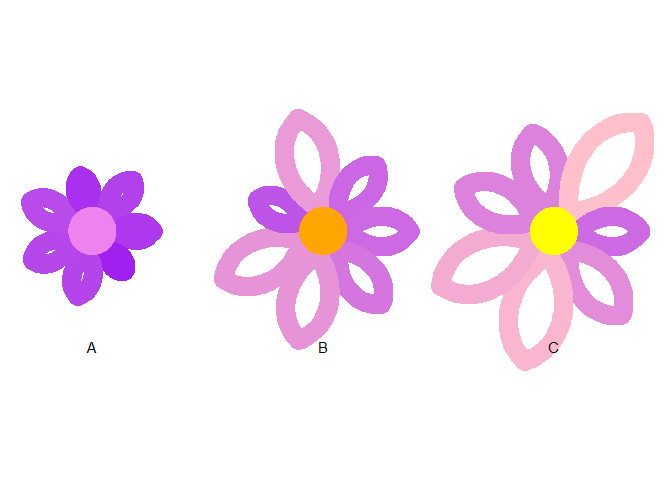

# About

This package provides a single function `make_flowers`.

## Installation

You can install the development version of make\_flowers
[GitHub](https://github.com/) with:

``` r
# install.packages("devtools")
devtools::install_github("enricomanlapig/floweR")
```

## Usage

The function takes the following arguments (required in bold):

-   **A dataframe**
-   **A field that distinguishes each flower**
-   **A numeric field of petal lengths**
-   A field to map petal color
-   `x_margin` - a numeric field that controls how far the flowers are
    horizontally positioned from each other
-   `y_jitter` - a numeric field that controls the random vertical
    placement of each flower
-   `my_hole_size` - a numeric field that controls the size of the
    middle portion of the flower
-   `my_curvature` - a numeric value that indicates the width of each
    petal
-   `my_angle` - a numeric value between 0 and 180 that indicates where
    the widest point of curvature falls on the petal. Values closer to
    zero put this point closer to the middle of the flower, while values
    further from zero put the point further away.
-   `lwd` - a numeric value that controls the width of the petal lines

The function returns a `ggplot` object so other modifiers may be layered
on after the function is called

## Example graphic

``` r
library(floweR)
library(dplyr)
library(ggplot2)


num_petals <- 7

df <- data.frame(
  group = c(rep("A", num_petals),
            rep("B", num_petals),
            rep("C", num_petals)),
  metric = c(runif(num_petals, min = 1, max = 2)*0.5,
             runif(num_petals, min = 1, max = 2),
             runif(num_petals, min = 1, max = 2)*1.2)
)

df %>%
  draw_flowers(group, metric, metric, my_hole_size = 0.3, my_curvature = 0.7, my_angle = 130, my_lwd = 5) +
  scale_colour_gradient(low = "purple", high = "pink") + 
  scale_fill_manual(values = c("violet", "orange", "yellow")) + 
  theme(legend.position = "none")
```


